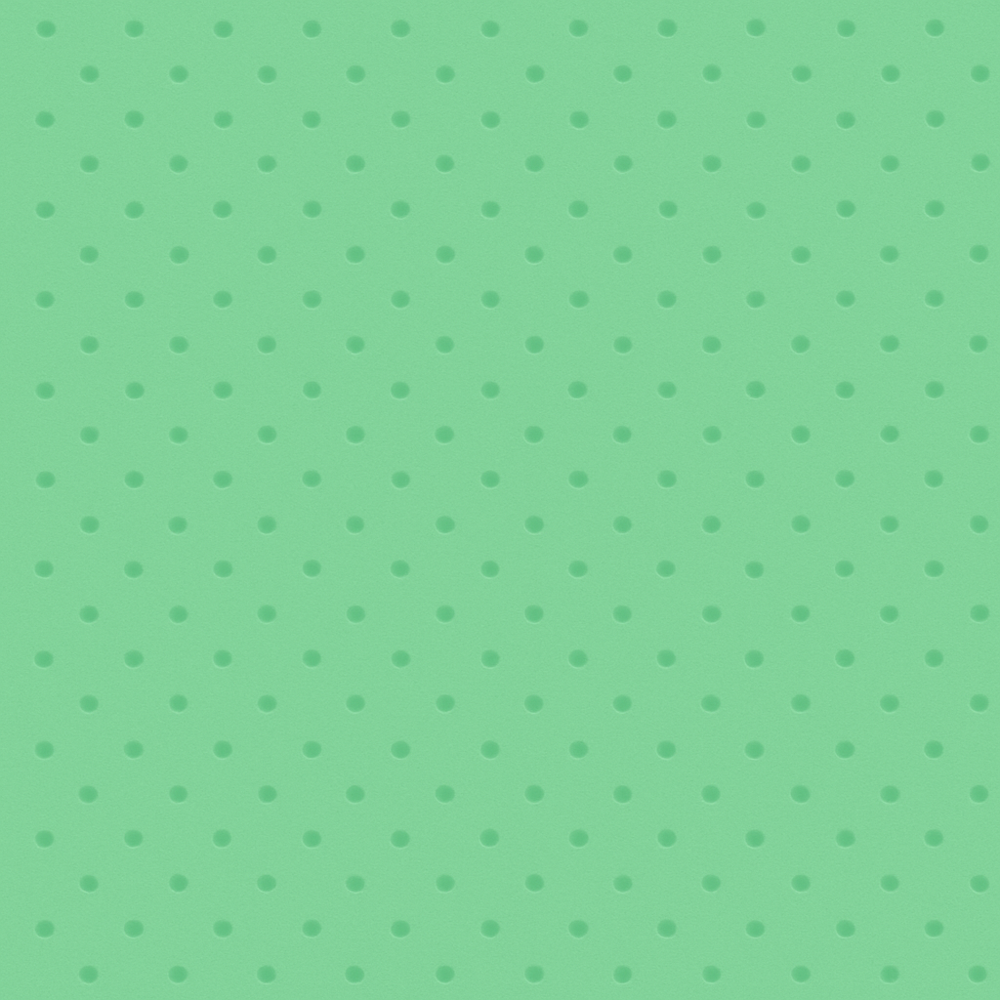
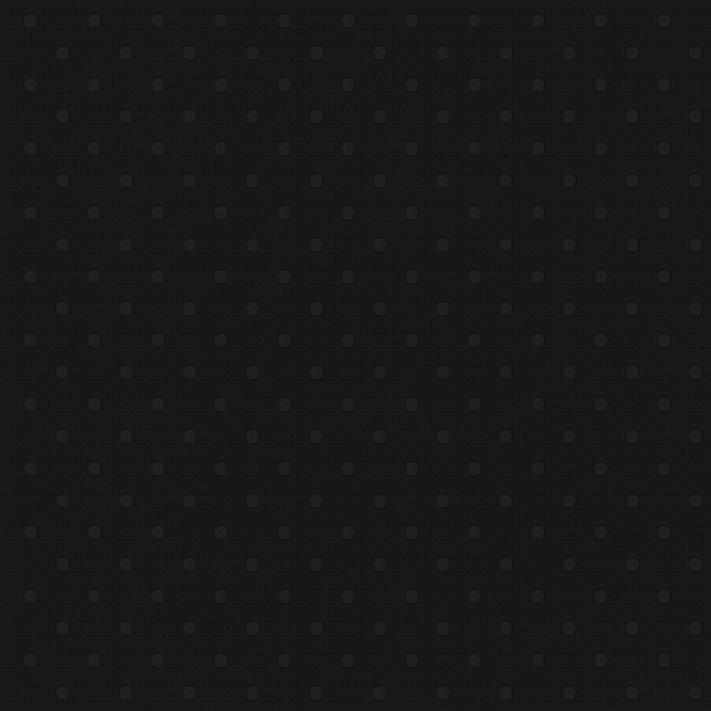

# 🎮 Simple Tetris
**Relax, Stack & Play**

A minimalist, pastel-colored Tetris-style puzzle game — no ads, no tracking, no distractions.  
Just you and the blocks.

---

## 🌈 Features
- Clean, calming interface
- Light & Dark themes (automatic)
- Soft pastel color palette
- Smooth animations and haptics
- Auto-save progress
- Top 10 high-scores leaderboard
- Works completely offline
- Zero ads, analytics, or tracking

Built with **Ionic + TypeScript** for iOS and Android.

---

## 🧩 Gameplay
Stack falling blocks to complete full rows and clear them from the board.  
Keep the board clear as long as possible — once it fills up, it’s game over.

---

## 📱 Screenshots
*(add your images here once uploaded to GitHub or your store listing)*

| Light | Dark |
|:--:|:--:|
|  |  |

---

## 🧑‍💻 Developer
**Gustavo Cortez**  
Independent software developer from Argentina.  
📧 [autocortez83@gmail.com](mailto:autocortez83@gmail.com)

---

## 🔒 Privacy Policy
**Last updated:** October 2025

Simple Tetris respects your privacy.  
The app does **not** collect, store, or share any personal information.  
There are **no ads, analytics, or tracking SDKs**.

### Data Stored Locally
- **Game progress & scores:** saved only on your device.
- **Settings & preferences:** (theme, sound, etc.) stored locally.

If you contact me by email, your address and message are used solely to reply to you and are never shared.

---

## ⚖️ Terms of Use
**Last updated:** October 2025

1. **Acceptance** — By downloading or using Simple Tetris, you agree to these Terms.
2. **License** — Granted a limited, non-exclusive, non-transferable license for personal, non-commercial use.
3. **Intellectual Property** — All code, artwork, and assets are owned by Gustavo Cortez.
4. **Updates** — Future updates may change features; continued use means you accept the new terms.
5. **Limitation of Liability** — Provided “as is,” without warranties of any kind.
6. **Governing Law** — These terms are governed by the laws of **Argentina**.

📩 [autocortez83@gmail.com](mailto:autocortez83@gmail.com)

---

## 🛠️ Support
If you find a bug or want to suggest an improvement:  
📧 [autocortez83@gmail.com](mailto:autocortez83@gmail.com)

Include your device model and OS version if possible.  
I usually reply within a few business days.

---

## 🖼️ Assets
| File | Purpose |
|------|----------|
| `assets/splash.png` | Light-mode splash screen |
| `assets/splash-dark.png` | Dark-mode splash screen |
| `assets/icon-only.png` | Main app icon |
| `assets/icon-foreground.png` | Adaptive icon (foreground) |
| `assets/icon-background.png` | Adaptive icon (background) |

---

## 🧾 License
Copyright © 2025 Gustavo Cortez  
All rights reserved.  
Simple Tetris is distributed for personal, non-commercial use only.

---

**Made with 💛 by Gustavo Cortez**
